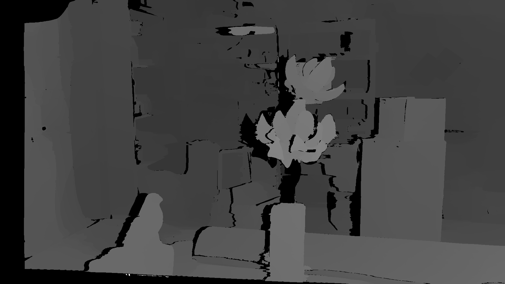
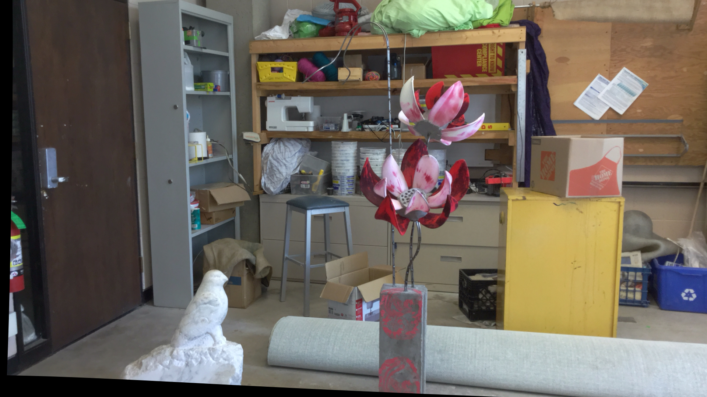
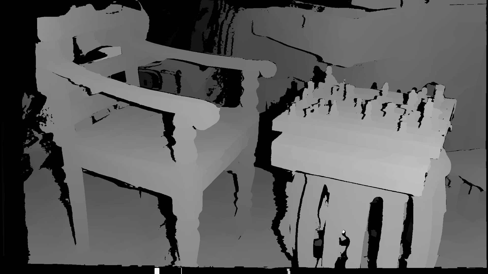
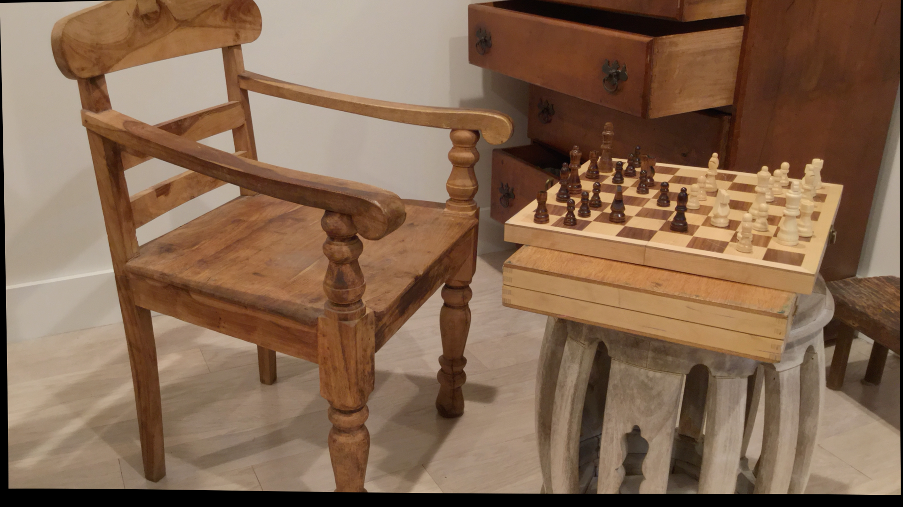
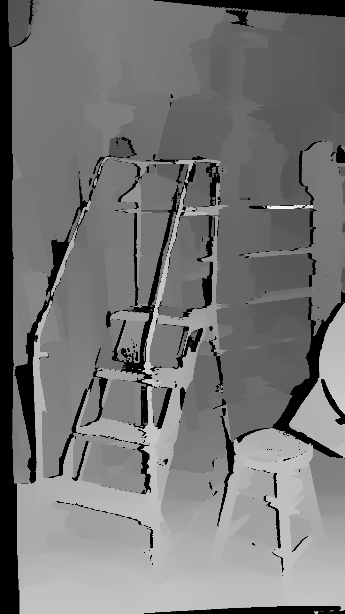
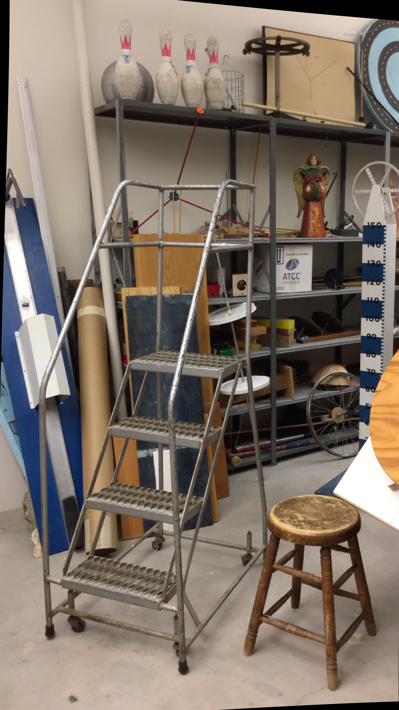

# AdCensus-CUDA







# Introduction

This repo contain re-implement GPU Algorthim for real time depth sensing using AD-Census for passive/semi-passive stereo setting, this code is purposed for coarse real time depth sensing, and in order to achieve a acceptable frame rate in a serious system,the visualization result was tested on Middlebury latest dataset: https://vision.middlebury.edu/stereo/data/scenes2021/

## Paper and Material

https://xing-mei.github.io/files/adcensus.pdf

https://github.com/ethan-li-coding/AD-Census/projects?type=beta (cpu code is mainly refer to this repo)

https://www.youtube.com/watch?v=MZsSTpS-XGI&t=157s

## Compilation

The code is fiirst written in 1080ti,and also test in 3060 with my laptop :D

CUDA 11.0 or above is required,the code is self-contained so you dont need any 3rd library.

In order to use std::filesystem,which is optional to find the path without dependency, you make want to set language standard to 

"-std=c++17 -Xcompiler "/std:c++17" 

Install the middlebury latest dataset 2021 and extract it to the project folder, rename it as "Dataset2".

## Speed

approx ~400x400 128 disparity 1080ti ~10fps (middlebury_old)

approx ~2kx1k 256 disparity 1080ti 1.5s/frame(middlebury_latest)

## Usage

```c++
 option.min_disparity = 0;
 //the max disparity, must set to times of 32 ,e.g. 64/128/160/256....
 //you always set the middlebury-new to 256, middlebury old to 128 will be best
 option.max_disparity = 256;
 //if not do filling, algorthim only do lr check, and will not fill the lr area, good for realtime application
//if do filling, fill all the bad lr area base on paper's description
option.do_filling = false;
option.height = l_height;
option.width = l_width;
//threshold of lr check, if you want disparity map to be very precise, you could use 1.0, use high lrcheck could have smoother surface
 option.lrcheck_thres = 1.0f;
 ADCensusStereo* stereo = new ADCensusStereo(option);
 stereo->SetOption(option);
 stereo->Init();
//you only init once, and memory is reuse at every time
 stereo->SetComputeImg(image_left, image_right);
 stereo->Compute();
 float* image_disp_left = stereo->RetrieveLeftDisparity();
```

## Limitation

1. The min disp must be 0, **the max disp must be times of 32**, e.g.(32/64/96/128...)
2. As the original purpose of this code is try to do some serious measurement in realtime system, I did not implement all part of the postprocessing procedure(based on the paper, I do not implement the edge discontinuity adjustment part in **Multistep-Refinement**) and I always run the result only with traditional Left-Right Consistency Check post-processing to ensure only the high precision disparity is retrieved, as the postprocessing it's not trust worthy measurement and will lead to wrong result in my application.I suggest people using this code to implement you **own postprocessing** pipeline instead of using mine or using the method the paper mentioned, as the postprocessing is varied these day from many paper and the paper's method is sub-optimal based on my experience.
3.  Read the paper and you will find this code is quite straight forward :D

